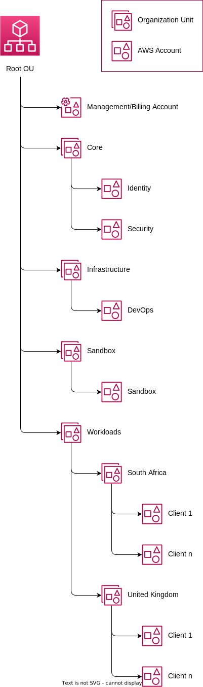
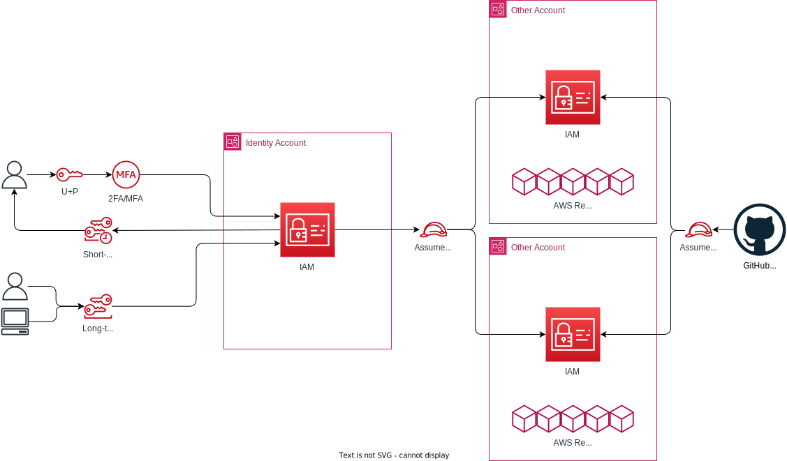
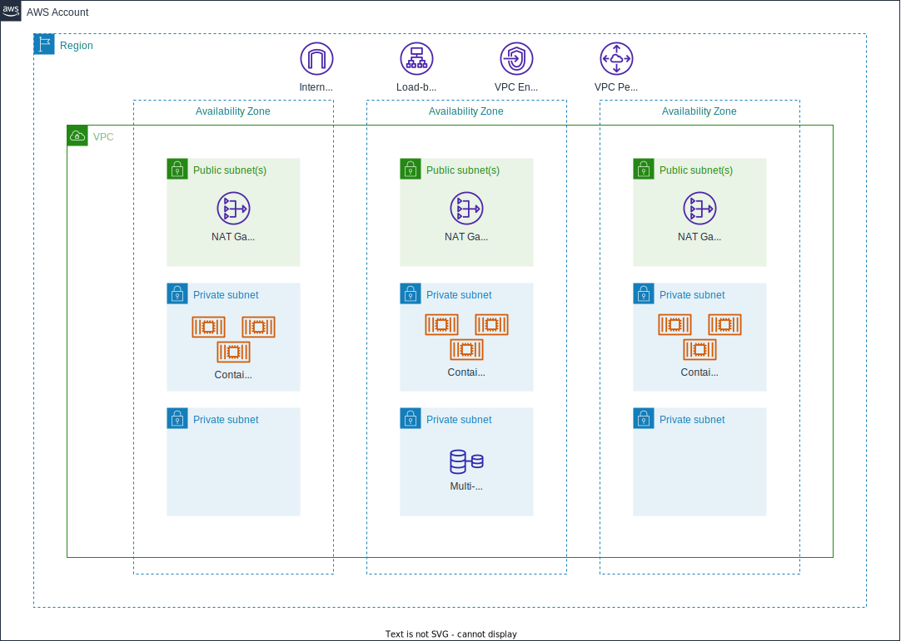

# rp-ta

Root Platform: ISO - Technical Assignment

## Overview

This repository contains architectural designs, diagrams and discussions around building a secure, multi-tenanted AWS setup. This is hypothetical in nature and does not relect any existing or potential future infrastructure.

## Zero Trust Architecture

### Data Sovereignty & Isolation

In order to adhere to any legislation, especially around data sovereignty, we can make use of an AWS multi-account strategy where Service Control Policies (SCPs) are applied at the Organizational Unit (OU) level. This allows us to control "absolute" policy conditions for users and resources, regardless of the permissions assigned to a user/role in affected accounts.

In addition, by using an "AWS account-per-client" approach, we are guaranteeing resource isolation as cross-account communication would have to be explicitly defined.

The below diagram is an example proposed setup for a multi-account strategy on AWS:

#### AWS Accounts

By using the above model, we have a separation of concerns based on an account level.

- **Management/Billing:** This is the "owner" of the organization. Its only purpose is to spin up sub-accounts and manage billing and SCPs. No AWS resources are ever created in this account.
- **Identity:** This is the primary authentication account. This account holds all the IAM users, groups and roles. It is the only account in which users exist, and where direct authentication takes place.
- **Security:** This account receives all the CloudTrail, S3, Load-balancer, VPC, etc. logs from all other accounts. It also has resources that either do direct inspection of logs, or ships them to a third-party such as Datadog for further analysis, monitoring and alerting.
- **DevOps:** This account hosts any DevOps, infrastructure and CI services.
- **Sandbox:** This account (and any other accounts under the `sandbox` OU) can be used for playing around with services outside of the control of Terraform or other Infrastructure as Code (IaC) tools. SCPs can (and shoud) also be tested in this OU.
- **Workloads:** This is where all platform and client platform service account are created.

#### Using SCPs for Sovereignty & Isolation

When used correctly, and [AWS SCP](https://docs.aws.amazon.com/organizations/latest/userguide/orgs_manage_policies_scps.html) is a powerful tool that can be used to determine exactly who and what is allowed to be done in accounts to which they are applied.

As an example in this case, we could use a policy in the `South Africa` OU that denies the creation of any resources outside of the `af-south-1` AWS region, and likewise for the `United Kingdom` OU and the `eu-west-2` region. This would ensure that it is impossible to create resources outside of these regions, regardless of the permissions given to users in accounts.

In addition, SCPs can be used as guardrails to ensure that resources created in accounts adhere to legislative policies, such as S3 Bucket encryption and TLS versions used in communications to, and between, services.

#### Authentication

Access to AWS accounts in a multi-account strategy is based on IAM role assumption. The below diagram shows how this could be achieved:

By using the `Identity` account to hold all users and groups, we can centrally control access and permissions. Users would be granted the ability to assume IAM roles in sub-accounts, and said sub-accounts would trust that any validations have already happened in the initial authentication.

Users would log in to the `Identity` account in one of two ways:
- Username & password combination, with an enforced multi-factor authentication (MFA) policy, which grants temporary credentials (default 12-hours)
- IAM access keys, which are long-term credentials that don't (by default) expire

Machine accounts, where they can't use temorary credentials, would also use IAM access keys.

Included in the diagram is an example service (GitHub) that assumes a role in accounts using OpenID-Connect (OIDC), which would be the preferred way for third-party services to be granted access to accounts. Because of the way OIDC on AWS works, this is not done through the `Identity` account, but rather every account would have the OIDC provider configured, allowing direct access to retrieve temporary credentials.

### Resource Implementation

The below diagram is an example of the resources that could/would be implemented in each workload account:

Each account that needs to run compute resources would need, at minimum the following:

- **VPC:** a virtual network in which all resources that need an IP address need to be hosted. The VPC is created spanning multiple availability zones (AZs) for redundancy. If a resource is multi-AZ capable, it should be set up as such so that in the event of a failure in the resource, or an entire zone, operations are able to continue with little to no downtime.
- **Internet Gateway:** this allows egress traffic to leave the VPC bound for the public internet and allows inbound traffic to public subnets.
- **Public Subnets:** these are portioned-off IP address spaces that have direct access to internet using the public IP space, and can be connected to directly from the internet. Resources would need to be secured using network access control lists (NACLs) and security groups (SGs) to prevent unauthorised access. Only resources that *need* direct ingress/egress traffic to the public internet should be created in these subnets.
- **Private Subnets:** these subnets hold all the infrastructure needed in order to run the platform. They don't have direct access to the internet, but rather communicate via a NAT gateway if one is configured to allow traffic from the subnet to the public internet. There can be multiple private subnets. As an example, it's best-practice to have databases in a separate subnet from compute workload subnets, and to control ingress/egress traffic using NACL rules.
- **NAT gateway:** this is a device that allows resources in private subnets to communicate with the public internet. It does not allow access *from* the internet to connect to the resources.

In addition to the above, supporting resources such as load-balancers (to spread incoming requests amoung multiple compute instances), VPC endpoints (which allow routing to AWS services such as S3 over internal IP ranges so that it doesn't go over the internet) and VPC peering (which connects multiple VPC together) can be created to support the platform architecture.
